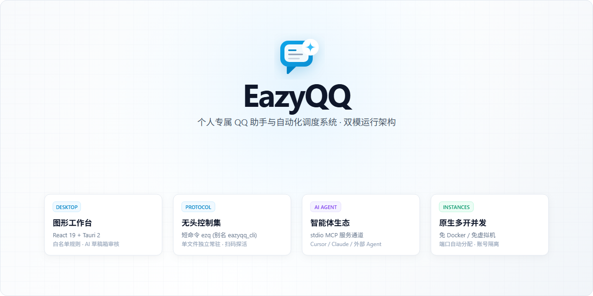

<p align="center">
  
</p>

<p align="center">
  <a href="https://github.com/LING71671/EazyQQ/releases"></a>
  
  <a href="LICENSE"></a>
</p>

<p align="center">
  一个桌面工作台，管理多个 QQ 账号。需要自动化时，用 CLI 或 MCP 接入。
</p>

<p align="center">
  <a href="https://github.com/LING71671/EazyQQ/releases"><strong>下载与版本</strong></a> ·
  <a href="#快速开始">快速开始</a> ·
  <a href="docs/API_SPECIFICATION.md">接口文档</a> ·
  <a href="CHANGELOG.md">更新日志</a>
</p>

## 多个账号，一个工作台

| 账号独立 | 回复可控 | 自动化接入 |
| :--- | :--- | :--- |
| 独立端口、数据库、模型会话和浏览器缓存 | 默认忽略未授权会话，支持草稿审核与规则回复 | 桌面后端能力提供 CLI，MCP 使用标准 JSON-RPC |
| 批量登记、启动、登录和停止 | 按群生成简报，索引并处理群文件 | JSON 输出、命令 schema 和账号常驻工作进程 |

账号切换先确认身份；快速凭据失效时打开目标二维码，原会话继续保持连接。健康诊断指出具体环节，修复保留已登录和外部管理的 QQ。

## 选择你的使用方式

**桌面端** — 扫码登录、管理账号、配置联系人规则、审核草稿和查看简报。

**CLI** — 给脚本和自动化流程使用，支持批量账号、JSON 输出和独立常驻工作进程。

**MCP** — 让智能体通过 `tools/list` 发现工具，再按授权操作 QQ。

```powershell
eazyqq_cli accounts start --uins 10001,10002 --dry-run --json
eazyqq_cli --account 10001 run
eazyqq_cli mcp
```

## 快速开始

1. 在 Windows x64 安装官方 QQNT，从 [Releases](https://github.com/LING71671/EazyQQ/releases) 选择桌面安装包或 CLI ZIP。
2. 打开账号管理，登记 QQ 号，使用对应账号扫码确认；多个账号可以独立保持在线。
3. 在系统设置选择模型并测试，再启用所需联系人规则；自动回复和草稿发送会影响真实 QQ 联系人。

`0.5.4` 修复包：[桌面安装包](https://github.com/LING71671/EazyQQ/releases/download/v0.5.4/EazyQQ_0.5.4_x64-setup.exe) · [CLI ZIP](https://github.com/LING71671/EazyQQ/releases/download/v0.5.4/eazyqq-cli-windows-x64.zip) · [发布说明与校验和](https://github.com/LING71671/EazyQQ/releases/tag/v0.5.4)。

## 用你选择的模型

OpenCode 免费模型通过本机原生运行时调用；自定义或本地兼容服务通过 HTTP 接入。模型目录展示可选项，显式测试确认当前是否能推理。

```powershell
eazyqq_cli ai-models --json
eazyqq_cli ai-set --provider opencode --model big-pickle --json
eazyqq_cli ai-test --prompt "Reply only OK" --json
```

使用 OpenCode 需先安装其原生运行时；QQ 可能要求重新扫码。规则和数据默认保存在本机，选择云端模型时，被允许处理的内容会交给对应服务。

## 给开发者与智能体

| 你需要了解 | 从这里开始 |
| :--- | :--- |
| 产品能力与交互 | [产品规格](docs/PRODUCT.md) · [设计规范](docs/DESIGN.md) |
| 目录、任务与数据隔离 | [架构](docs/ARCHITECTURE.md) |
| 桌面与命令行契约 | [IPC](docs/api/IPC.md) · [CLI](docs/api/CLI.md) · [覆盖矩阵](docs/api/COVERAGE.md) |
| 参与开发和复现检查 | [贡献指南](CONTRIBUTING.md) · [开发记录](docs/development/2026-10-08-reliability.md) |
| 构建与发布 | [发布流程](docs/release/RELEASING.md) · [云端验收记录](docs/development/2026-10-09-release-validation.md) |
| 智能体入口 | [llms.txt](llms.txt) · [完整操作指南](llms-full.txt) |

<details>
<summary><strong>从源码启动</strong></summary>

需要 Node.js、pnpm、Rust、MSVC、QQNT 和协议资源。Windows 包装脚本自动定位 MSVC。

```powershell
pnpm install --frozen-lockfile
pnpm tauri:dev
```

构建、验收和环境约束见 [贡献指南](CONTRIBUTING.md)。所有项目文档使用中文，命令与接口标识保留英文。

</details>

<details>
<summary><strong>CLI 包与环境</strong></summary>

桌面安装包包含 `eazyqq_cli.exe`；CLI ZIP 提供 `bin/eazyqq_cli.exe`、兼容名 `bin/ezq.exe`、协议资源和中文文档。

`EAZYQQ_ROOT` 可指定独立的数据根目录；`EAZYQQ_OPENCODE_BIN` 可指定原生 OpenCode。发布包排除个人协议配置、凭据、日志和缓存。

</details>

---

基于 Tauri、Rust、React、TypeScript、SQLite 和 NapCat / OneBot 11。遵循 [Apache 2.0](LICENSE) 许可证。
