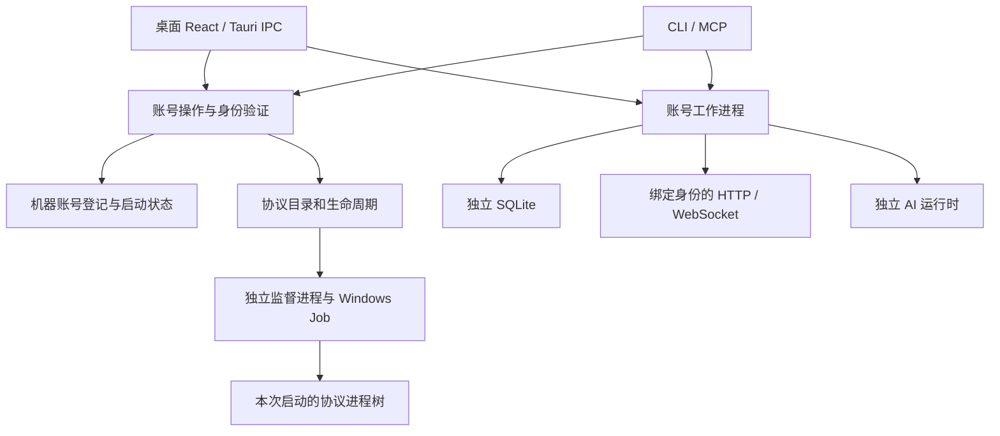

# EazyQQ 架构说明

适用于 0.5.3。开发记录中的历史路径仅用于解释旧问题，当前源码与接口以本文及 `docs/api/` 为准。

## 适配层与领域服务

桌面 IPC、CLI 和 MCP 是不同的入口，复用身份、协议、存储、模型和工作流服务。账号身份属于持久化领域；启动、停止和协议目录属于运行时领域。适配层不应维护另一套登录或杀进程策略。



“当前账号”只决定显示和数据上下文，不是让其他 QQ 下线的指令。认证证据必须包含目标身份；确认后才写入启动选择。桌面切换通过重建应用上下文生效，旧数据库和模型句柄不在原地改绑，避免执行中的任务写入另一个账号。

## 目录分层

| 领域 | 子目录与职责 |
| --- | --- |
| `services/protocol/` | `auth/` 登录，`runtime/` 进程与目录，`transport/` OneBot，`messaging/` 消息，`health/` 诊断，`tests/` 回归 |
| `services/identity/` | `accounts/` 登记、启动状态、迁移；机器标识保持独立 |
| `services/ai/` | `runtime/` 调用与配置，`catalog/` 模型目录，`tests/` |
| `services/storage/` | `database/` 连接与结构，`tables/` 各表操作，`tests/` |
| `services/workflows/` | `files/` 文档和群文件，`summaries/` 简报，`monitoring/` 链路，`tests/` |
| `services/infra/` | `system/` 配置、版本、持久化；`updates/` 选择、下载、安装交接与核心升级；`diagnostics/` 日志包 |
| `bin/eazyqq_cli/commands/` | `protocol/`、`chat/`、`ai/`、`system/`、`integrations/` |
| `src/` | `api/` 契约，`hooks/` 状态，`features/` 领域辅助，`components/` 与 `views/` 界面 |

Rust 模块入口保留公共导出，具体文件按职责分类。增加文件时选择已有子目录；目录职责变宽时继续拆分，避免用一个服务文件承载账号、网络、模型和界面。

## 数据与浏览器隔离

```text
EazyQQ_Data/
  bootstrap.json
  accounts/<machine-id>/
    instances.json
    <uin>/
      eazyqq.db
      message-worker.lock
      protocol/
        config/
        cache/
        logs/
        eazyqq-process.json
      ai-runtime/
        data/
        state/
      webview/<window-label>/
      group_files/
      diagnostics/
```

每个账号保留三个独立端口。检查端口时同时执行连接探测和绑定检查，不能仅凭 Windows 绑定成功认定端口空闲。只允许未生成私有配置的新登记修复过期预留；已存在或外部运行的会话不因端口冲突而被清理。

私有登记 JSON 使用历史 `snake_case`，公共 DTO 使用 `camelCase`。JSON 修改持有系统文件锁并原子替换；损坏登记文件导致修改失败，保留原文件。SQLite 启用 WAL、NORMAL、外键、64 MiB 缓存和 5 秒忙等待。已有目标数据库不能混入来源数据库的 WAL/SHM。

浏览器绝对路径通过 `WebviewWindowBuilder.data_directory` 设置；Tauri 的 `dataDirectory` 配置只接受相对路径，不能把绝对路径放入该字段后假定隔离成功。原生验收验证两个账号的 localStorage 独立且往返切换后正确恢复。

## 协议进程所有权

创建随机 Windows Job 后，以挂起状态启动协议启动器，先纳入 Job 再恢复线程。独立监督进程保持 Job 句柄，使启动器退出或 CLI 结束后仍可定向管理进程树。

监督进程使用内容散列命名的可执行文件副本，避免锁定构建产物。WMI 脱离调用者终端的进程寿命边界；`ShowWindow` 必须使用 `UInt16`。Job 名保存在私有收据中，PID 只作信息展示，不能作为终止权限。

没有受验证 Job 的外部 QQ 会话不在生命周期控制范围。禁止按进程名结束 QQ、按陈旧 PID 清理、诊断时自动尝试登录或统一重启全部账号。

旧进程树存活不等于协议服务就绪。中止安装可能留下已加载 DLL 与缺失主体；状态探测只报告此故障。`runtime/recovery.rs` 在显式恢复时先准备并验证新版私有副本，之后才沿旧 Job 所有权停止该树。迁移后桌面重建客户端上下文，避免继续使用旧目录 token；不删除旧目录，不操作其他 QQ。

## 消息与任务隔离

HTTP 客户端绑定预期账号，读取名单、历史、文件和发送前都验证身份。WebSocket 丢弃 `self_id` 不匹配的事件。工作进程持有固定账号数据库和 AI 目录；文件路径来自绑定身份，冷却键包含账号与会话类型。

跨 GUI/CLI 的文件租约保证一个账号只有一个消息/调度消费者。移除工作进程时释放租约并取消任务。后台其他账号不把事件推给当前界面。CLI 控制器检查子工作进程的实际存活状态。

## 模型与健康

兼容模型通过 HTTP/SSE 调用；SSE 按完整行解码，避免 UTF-8 跨网络块断裂。文件上限在流式接收过程中执行。

OpenCode 使用原生运行时、当前模型目录、账号私有会话和非交互工具权限。普通云模型密钥不自动成为 OpenCode 密钥。原生文本可能按段输出，目录 metadata 不能代替推理检查。

登录、界面、CLI 和诊断复用校验证据。OneBot 的正确身份可覆盖陈旧 WebUI 标志。等待扫码和未测试推理保持未知。周期监控不生成模型请求；显式测试记录推理健康。恢复只启动缺失服务，保留认证成功、已经运行和外部管理的协议会话。

## 版本、打包与维护

版本来自构建清单或运行时 metadata，更新排序使用包含预发布标识的 SemVer。协议归档先暂存，拒绝路径越界与符号链接，保留账号配置、缓存和回滚备份；升级持有独占维护锁，启动持有共享锁。

发布时准备中性的协议配置，排除凭据、QQ 路径、账号配置、数据库和日志。桌面包包含 CLI，独立 CLI 包保留兼容别名。更新清单和 SHA256 校验和随版本生成。

单元测试的根目录强制位于每进程 `.test-runtime`，即使直接运行 Cargo 也不能迁移或删除真实数据。接口变更要更新适配层、行为测试、生成契约及中文开发记录。详见 [贡献指南](../CONTRIBUTING.md) 与 [发布流程](release/RELEASING.md)。

## 0.5.3 入口与更新领域

Electron 拼接 appPath 与 package.main；runtime/entry.rs 生成相对 .cjs 入口，同盘使用私有路径，跨盘使用目录桥接。桥接优先使用同盘 LOCALAPPDATA，再选数据根或 QQ 盘的 EazyQQ_Runtime；既有链接必须指向同一账号目标，QQ 安装文件不改动。

infra/updates 复用到 GUI、CLI 与 MCP，选择稳定版本及精确官方资产，流式接收并校验，暂存使用用户可写目录。主程序助手通过 WMI 脱离终端，等待调用者退出后安装；核心使用维护锁和保留配置的暂存部署。

## 安装资源与运行时副本

桌面包资源位于 resources/protocol/<应用版本>，新版本不覆盖旧协议路径。固定账号与未绑定运行时均在 EazyQQ_Data 中使用文件副本，禁止硬链接回安装载荷；Windows 映射 DLL 的写锁会通过硬链接影响安装源。旧安装目录中的活跃会话仍按原端点和所有权读取，不因重装而退出。

新未绑定会话在 _unbound/protocol 启动，配置、加载器和补丁均私有；准备动作只在实际启动且端口空闲后发生。源码、桌面与 CLI 共用协议资源定位服务。CLI ZIP 保留 napcat 目录布局。
