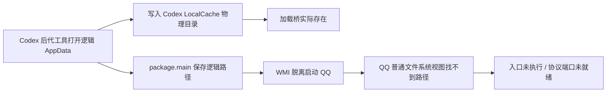

# QQ 加载入口故障溯源与诊断链路

## 本轮范围

用户要求先定位问题并做好溯源及诊断链路。停止重复启动，保留外部 QQ；不发布产品版本，不实施登录态或内存策略。源码新增诊断能力尚未安装到用户桌面。

## 已确认事实

| 层次 | 证据 | 结论 |
| --- | --- | --- |
| 安装与私有载荷 | 三个不可变资源逐文件 SHA256 一致 | 排除私有复制缺失或内容不一致 |
| 私有加载器 | loadNapCat.cjs 存在，大小 118 字节 | 文件存在不能代表 QQ 已执行 |
| 生成入口 | package.main 为 116 字节相对路径，无字面省略号 | 截图省略号不能据此判定路径被写坏 |
| 加载桥 | C 盘用户目录 junction 指向 A 盘私有目录，规范路径相同 | 普通文件系统层能通过桥读取 |
| 普通 Node | Node 22.22.1 require.resolve 与 realpath 成功 | 不能代替 QQ 内部运行时解析 |
| Windows API | GetFileInformationByName 的 0/3 类，普通与长路径形式均成功 | 未观察到普通文件 API 的失败 |
| QQ 实际启动 | 用户截图为 Cannot find module；引导日志仅到 Process resumed | 真实模块加载失败，启动接受不是就绪 |
| 服务 | 3000、3001、6099 未监听 | 协议链路没有完成初始化 |

A 盘为健康的固定 NTFS 卷，没有证据支持“映射盘失效”。当前没有完整 QQ 内部文件访问结果或进程缓解策略快照，不能将权限、RedirectionGuard、QQ 自身限制或注入钩子行为写成确定根因。

本机异常后关闭当前 EazyQQ 以阻止 GUI 自动拉起；再调用绑定目录的 CLI stop，由受验证 Job 控制失败树。只读检查确认原 QQ PID 7464、启动时间 07:59:07.64301 及 A:/NTQQ/QQ.exe 路径保持不变。本轮未再次启动本机 QQ 做实验。

## 诊断覆盖缺口

旧 napcat-doctor 硬编码根目录/napcat，可能错过真实私有目录；已改为复用 source 定位和 selected 布局。历史诊断只检查资源存在、全机 QQ 数量和引导日志写入，不证明 QQ 执行入口。旧假引导器回归只能证明 Job、文件与登记迁移，不包含 QQ 模块解析。

先前真实 QQ 云端验收使用用户目录 QQ；本机 QQ 在 Program Files。两者入口的相对路径与路径上下文不同，不能直接迁移结论。本轮云端对照仍待结果：相同不可变安装夹具分别放在用户目录与 Program Files，保存真实弹窗文字、加载器凭证、端口和暂停调试器结果；不扫码，不发送消息。作业 37905077835 为证据采集作业，不是发布验收。

## 新证据链

health/startup_trace.rs 生成结构化快照：private_payload、entry_resolution、private_loader、launch_request、loader_execution、qq_module_load、owned_process、webui_transport、authenticated_session。状态为 passed/failed/unknown，分别记录首个失败与首个未确认。快照中的 ready 不能因文件或 TCP 探测成功而设为真。

每次实际启动写 eazyqq-startup-attempt.json，生成加载器包含该 attemptId；加载器执行写 eazyqq-loader-witness.json，区分 loader_entered、module_imported、module_failed，仅记录 PID、版本、时间和错误类型/代码，不记录凭据、消息或整个环境。写凭证失败不阻断协议代码。监督进程接受请求另写 eazyqq-startup-launch.json；陈旧凭证不得用于新尝试。旧版本只有 launch plan/result 时使用 legacy 请求编号并明确 attemptOrigin；缺少新加载器凭证保持 unknown。

napcat-doctor --json 增加 startupTrace；诊断 ZIP 增加 protocol/startup-trace.json。捕获操作只读，不生成新的启动尝试、快速登录或重启，也不主动进行 AI 推理。身份证据仍由账号只读探测提供，不能从窗口、Job 或端口推断登录成功。

## 验证及未完成项

已新增真实 Node 导入成功/失败凭证、陈旧凭证拒绝、仅 TCP 不能证明认证就绪、凭证不包含错误文本中的秘密、旧启动收据只读关联等回归。Rust、CLI 及生成契约的最终结果在执行后补充。

当前根因仅收窄到 QQ 内部加载入口层；最终致因仍待云端对照和真实运行时证据。不会用诊断收集作业的成功代替产品登录成功，也不会因一个猜测继续发版本。

## 首轮云端取证准备失败

作业 37905077835 未执行 QQ：Prepare immutable fixtures 返回 release not found。临时夹具确实存在且为未公开草稿，但工作流只授予 contents:read。GitHub 官方文档明确只有 push 权限可列出草稿，历史可用真实 QQ 取证工作流也使用 contents:write。本轮将单一取证作业的临时 GITHUB_TOKEN 改为 contents:write 以读取草稿；工作流没有发布步骤。该失败不能写成 QQ 加载失败，也不能写成取证通过。

参考：https://docs.github.com/en/rest/releases/releases#list-releases 。临时夹具只含不可变 QQ 安装代码，上传至未公开草稿，取证结束后删除附件，不进入任何公开产品版本。

## 最终根因：调用者路径被虚拟化，QQ 使用另一文件系统视图

已通过同机真实 QQ 运行时作出控制验证，根因不再停留在“模块解析层”。工具打开的逻辑目录 C:/Users/www17/AppData/Local/EazyQQ，其 GetFinalPathNameByHandleW 返回 C:/Users/www17/AppData/Local/Packages/OpenAI.Codex_2p2nqsd0c76g0/LocalCache/Local/EazyQQ。因此工具创建的加载桥实际位于 Codex LocalCache，写入 QQ 的入口却仍使用逻辑 AppData 路径。WMI 脱离启动的 QQ 没有同一文件系统视图。

真实 QQ 的 Node 22.16.0 / Electron 37.1.0 / libuv 1.49.2 中，逻辑 EazyQQ 目录与桥路径的 exists/stat/read/resolve 返回不存在、ENOENT 或 MODULE_NOT_FOUND；改为上述最终物理路径，同一进程能读取 118 字节并 resolve 到 A 盘私有 loadNapCat.cjs。A 盘私有文件直接访问也成功。这一单进程对照证明文件内容与扩展名不是该故障的原因，错误在跨进程传递的路径视图。

注意：GetCurrentPackageFullName 在 Python 工具中返回 15700（无当前包身份），但最终文件句柄路径仍被重定向。不能只用当前包身份判断路径是否虚拟化，必须记录句柄解析后的物理目录及接收进程的实际结果。

## 被排除与无效的对照

云端作业 37921371970 的用户目录与 Program Files 两个 QQ 布局均导入模块、开放 WebUI，认证仍未知；因此 Program Files 位置不是单独致因。暂停调试阶段没有得到接口，不能算实际暂停成功。后续本机引导日志确认原生启动器把第三个任意参数改写为 -q 后的账号参数，调试参数并未按预期传递；已从取证脚本删除这段无效阶段。

本机先关闭 EazyQQ 自动拉起，用户随后明确授权本机拉起及追踪所需操作。诊断脚本使用独立受管理 Job，只读比较文件 API，没有调用消息 API。测试账号参数 10001 和登记目标参数仅用于引导诊断入口；诊断脚本没有导入 QQ 登录/消息业务模块。所有诊断树结束后关闭，当前原 QQ PID 38932、A:/NTQQ/QQ.exe、18:42:40.419524 启动时间保持。

QQ 中确有 Windhawk 及两个全进程插件，但未证实它们导致文件不可见。普通权限写 HKLM 被拒绝，提权启动返回“操作已被用户取消”，原配置未变。随后使用相同不可变 QQ 安装代码的普通与官方预置兼容路径对照：兼容路径中 QQ/启动器确实没有 Windhawk 模块，逻辑 AppData 文件仍不可见。因此本故障不依赖 Windhawk 注入，不能建议用户卸载或全局禁用它。

## 修复方向及当前边界

本轮不发布产品版本。后续修复应在跨进程传递前取得可供接收进程访问的物理路径，尤其是桥根目录必须在跟随最终跨盘 junction 前解析；不能硬编码 Codex 包名或当前机器路径。还需检查更新助手、监督进程及其他 LOCALAPPDATA 文件交接是否有同类问题。修复验收应覆盖虚拟化调用者与普通接收者的两种视图，不能只在调用者中 Test-Path 或 Node require.resolve。

已新增脚本 scripts/diagnostics/path_namespace.py，用只读句柄返回 logicalPath、physicalPath、redirected；启动追踪的入口证据新增逻辑/物理桥根及调用者重定向信息。快照仍不把调用者检查通过当作 QQ 已加载。原追踪回归 115 项通过，新增字段的最终复验完成后补记。

## B 盘清理

项目初始约 52 GiB，其中 target 约 50 GiB、debug 约 46 GiB。先保存当前诊断 CLI/辅助程序，再验证 target 的绝对路径属于本项目且不是目录联接，使用 scripts/cargo.ps1 clean --profile dev。Cargo 报告移除 37685 个文件、46.9 GiB 可重建产物；B 盘可用空间由约 11.8 GiB 增至 50.6 GiB。源码、账号数据、安装包和诊断证据保留。最后复验使用 A:/DevEnv/Caches/cargo/eazyqq-diagnostics，避免再次填满 B 盘。

可复查的本地证据：.test-runtime/path-namespace-proof.json、local-namespace-control.json、qq-startup-cloud-37921371970/、project-cleanup.log。Root 桥物理路径的测试证据保留；临时不可变 QQ 副本可在保存报告后移除。

## 最终复验与收尾

新增逻辑/物理桥根字段后，完整 Rust 回归再次通过：113 项库测试、2 项 CLI 测试，共 115 项；生成契约检查通过。只读 namespace 脚本在本机复验 redirected=true，QQ 控制验证对逻辑路径返回 ENOENT，对最终物理路径读取与 resolve 成功。原 QQ PID 38932 会话仍保留，所有诊断 Job 已停止。

计划保存 JSON/原生输出后递归移除仅含不可变 QQ 代码的临时副本，但自动审批在执行前拒绝，实际返回 blocked by policy，未提供更具体原因。因此临时副本未删除，不能记录为清理完成；本轮已经成功完成的是 Cargo dev 构建产物清理。未清理用户安装目录、账号数据库或 QQ 登录数据。公开产品标签保持不变，诊断源代码与文档单独提交。

下一步修复的验收入口已经明确：在真实物理父目录创建加载桥，并在普通 QQ 进程内确认实际可见路径；其他 LOCALAPPDATA 向脱离进程交接的助手同样检查物理路径。该修复尚未发布，也未据此宣称用户安装已经能登录。

后续源码修复与独立接收进程验证见 [物理路径交接记录](2026-10-09-physical-path-handoff.md)。本记录中的“尚未实现”描述对应本轮结束时的历史状态；公开 0.5.3 仍未包含后续修复。
